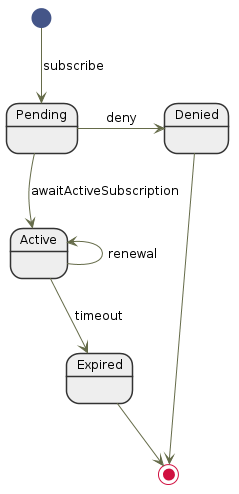

<h1>WebSub</h1>

<em>A <a href="https://www.w3.org/TR/websub/">WebSub (RFC7230)</a> client for Haskell</em>

## Overview

**This library is a work in progress, not really usable yet!** The plan is to
provide an easy-to-use interface for subscribing to WebSub topics in Haskell
web applications.

## Subscription

The following diagram shows how the subscription can change state.

## Contributing

I've just started hacking on this, so if you're interested in helping out or
giving feedback, post an issue and we'll take it from there.

## License

[Mozilla Public License v2.0](LICENSE).
